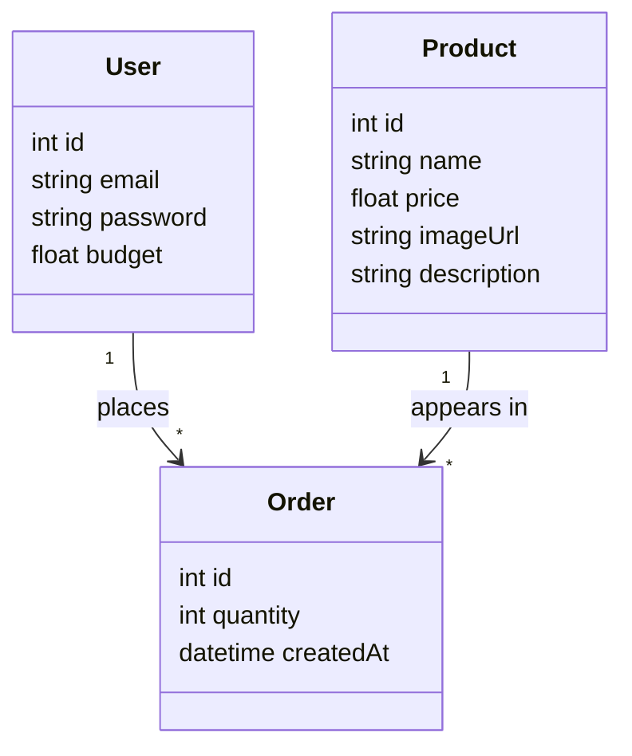

# Architecture

This explains how the pieces of the app fit together, in plain English.
See [CLAUDE.md](CLAUDE.md) for the stack summary and folder structure,
and [requirements.md](requirements.md) for what the app needs to do.

## The big picture
Everything lives in one Next.js project — there's no separate frontend
and backend to keep in sync. A single request to the app can:
1. Serve a page (HTML the browser shows), or
2. Hit an API route (backend logic, e.g., "place this order"), which
   talks to the database and sends back a result.

```
 Browser
   │
   ▼
 Next.js app  ──────────────► Prisma ──────────────► SQLite file
 (pages + API routes)          (translates JS calls    (the actual
                                into database queries)   data on disk)
   │
   ▼
 NextAuth (checks/creates the login session cookie)
```

## Components

### Next.js (pages + API routes)
- **Pages** (`app/login`, `app/catalogue`, `app/orders`) are what the
  buyer sees and clicks around in.
- **API routes** (`app/api/...`) are backend endpoints the pages call —
  e.g., `app/api/orders` handles "create a new order" and does the
  budget check server-side (never trust checks done only in the
  browser).

### Prisma + SQLite
- `prisma/schema.prisma` defines three tables: `User`, `Product`,
  `Order`.
- Prisma generates a JS client so code can write `db.product.findMany()`
  instead of raw SQL.
- SQLite stores everything in one file (e.g., `prisma/dev.db`) — easy to
  reset by deleting the file and re-seeding.

### NextAuth.js
- Handles the login form submission, checks the password against the
  hashed password stored for that user, and — if it matches — sets a
  secure session cookie in the browser.
- `middleware.js` checks that cookie on every page load; no valid
  session means an automatic redirect to `/login`.

### Tailwind CSS
- Utility classes used directly in the page/component code for styling
  (no separate `.css` files to maintain per component).

## Data model



**In plain English:**

There are three things the app needs to remember:

- **User** — a buyer. Holds their login details (email + a hashed
  password, never plain text) and their **budget**: the total dollar
  amount they're allowed to spend.
- **Product** — an item in the furniture catalogue: its name, price,
  an image to show, and a description. Products don't know or care who
  buys them.
- **Order** — the record that connects a User to a Product: "this buyer
  ordered this product, this many of it, at this time." An Order always
  belongs to exactly one User and points at exactly one Product.

The two arrows describe "one-to-many" relationships:
- **One User can place many Orders** — a buyer can order lots of things
  over time, but each Order was placed by one specific buyer.
- **One Product can appear in many Orders** — the same chair might be
  bought by ten different buyers, but each Order line is for one
  specific product.

Note that "amount spent" and "amount remaining" aren't stored anywhere
— they're calculated on the fly by adding up `price × quantity` across
a buyer's Orders. This keeps the data model small and means there's
never a stale number that's out of sync with the actual orders.

## Key flows

**Login**
1. Buyer submits email + password on `/login`.
2. NextAuth looks up the user by email, checks the hashed password.
3. On success, a session cookie is set and the buyer is redirected to
   `/catalogue`.

**Placing an order**
1. Buyer picks a product + quantity on `/catalogue` and confirms.
2. The page calls the `app/api/orders` endpoint with the buyer's
   session, product id, and quantity.
3. The API route re-checks (server-side, not just in the browser):
   current spend + (price × quantity) ≤ budget.
4. If it fits: an `Order` row is created and a success response is
   returned. If not: the API returns an error message and no order is
   created.

**Viewing orders / budget**
1. `/orders` fetches the buyer's orders + their budget from the
   database via Prisma.
2. The page computes spent = sum of order totals, remaining = budget −
   spent, and displays all three.

## Security notes (kept simple for Day 1)
- Passwords are hashed before storage (never compared or stored in
  plain text).
- Budget checks happen in the API route (server-side), not only in the
  UI — a buyer can't bypass the limit by tampering with the page.
- `middleware.js` blocks direct access to protected pages without a
  valid session.

## Deliberately not included (Day 1)
- No caching layer, no background jobs, no external APIs.
- No automated test suite — manual click-through testing only.
- No deployment/hosting setup described here; this covers running the
  app locally.
